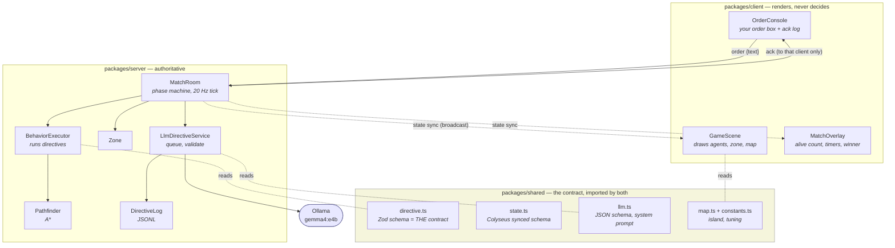
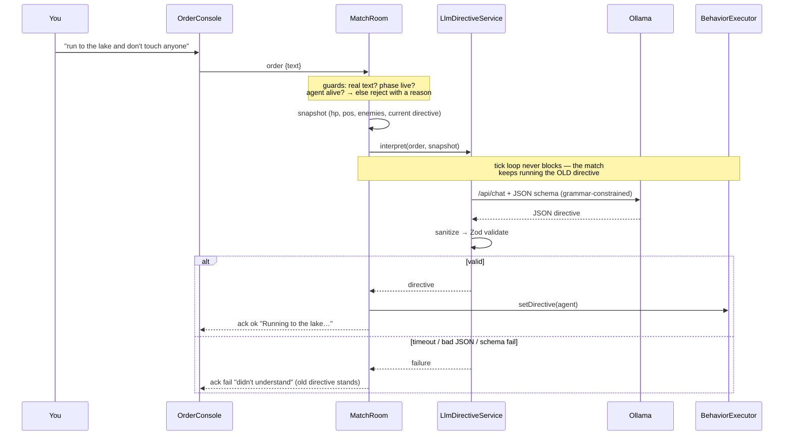
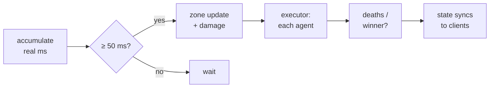

# Architecture

One rule explains most of it: **the server is the only source of truth.** The client renders
state and sends two things (an order, a join). It never decides anything.

## The pieces

`shared` exists so the `Directive` schema lives in exactly one place — the same Zod object
validates the LLM's output *and* generates the JSON schema handed to it.

## Who does what

| Component | Job |
|---|---|
| `MatchRoom` | Owns the match: seats agents, runs the phase machine, ticks at 20 Hz, handles orders. |
| `BehaviorExecutor` | Turns one directive into movement/combat, per agent, per tick. Stateless about *who* — a bot and a human are both just directives. |
| `Zone` | The shrinking circle; damages whoever's outside. |
| `LlmDirectiveService` | The only thing that talks to Ollama. Queue → call → sanitize → **Zod** → directive. |
| `DirectiveLog` | Appends every order→directive pair to `logs/directives.jsonl`. This is the prompt-tuning dataset. |
| `GameScene` | Draws synced state. No game logic. |
| `OrderConsole` | Your input box + your own order/ack log. Never sees other players' orders. |

## Sending an order

Two things guard against chaos: a **match-epoch fence** (a reply landing after the match
reset is dropped) and an **alive re-check** (your agent may have died while the model thought).

## The tick (20 Hz, fixed)

Wall-clock deltas are jittery, so the loop accumulates them and steps the simulation in exact
50 ms slices — the sim stays deterministic regardless of frame timing.

## Privacy

Orders and acks travel over `client.send()` to one client. Nothing order-related is ever
written to synced state, so it structurally cannot leak to other players. Positions, HP and
the winner are public — that's the whole synced schema.
