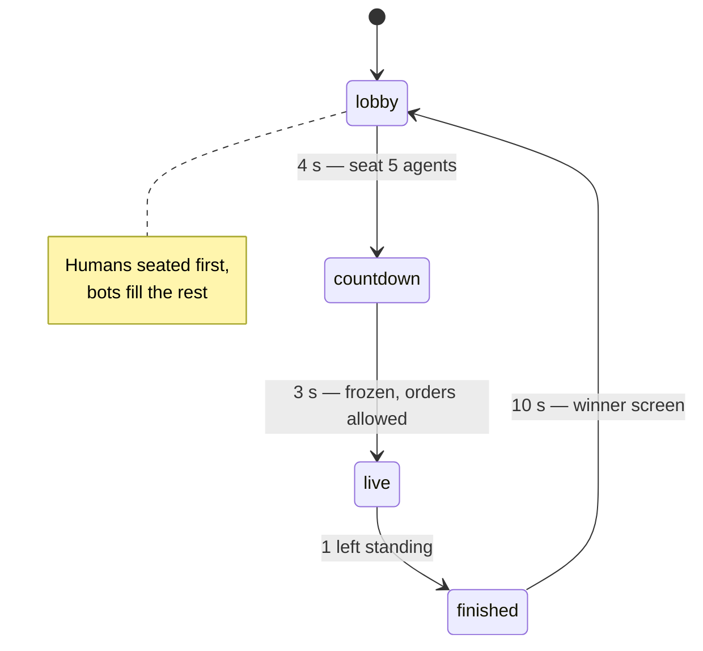
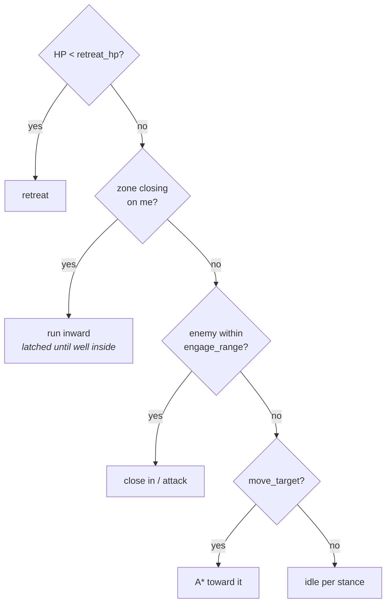
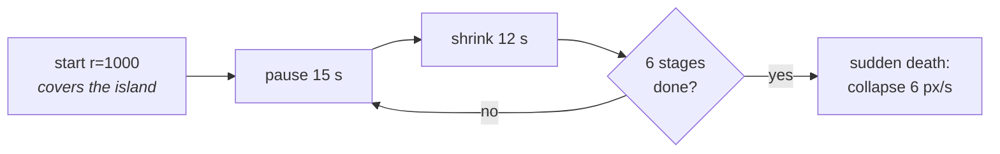

# Game mechanics

World: a 1920×1920 px island (60×60 tiles @ 32 px), fully visible — no scrolling camera.
Landmarks: `castle` (north), `forest_north`, `forest_south`, `lake` (west), `gold_mine`
(east), `center`. Every match seats exactly **5** agents.

## Match lifecycle

The room is created at boot and never disposes, so a match is always running — even with
zero players.



Join mid-match → you spectate until the next one. Disconnect mid-match → your seat becomes a
bot running your last directive.

## The directive — the only thing an agent has

Every agent, bot or human, is just one of these. There is no other AI.

| Field | Meaning |
|---|---|
| `stance` | `aggressive` \| `defensive` \| `evasive` \| `hold_position` |
| `move_target` | landmark \| exact point \| nearest_enemy \| null |
| `engage_range` | px within which it may fight. **0 = never attack** |
| `target_priority` | `closest` \| `weakest` \| `strongest` \| `ignore` |
| `retreat_hp` | fraction 0–1; below this it runs |
| `retreat_to` | landmark \| `away_from_enemy` |
| `acknowledgement` | the one free-text field — the agent's "thought", shown to you |

Bots get a hardcoded directive (hunter, castle guard, gold baron, lake lurker, coward — shuffled
per match). You get one from the LLM. **The executor cannot tell the difference** — that's why
bots cost nothing and need no model.

## What an agent does each tick

Strict priority, top wins:



Retreat outranks the zone deliberately — a coward can flee *into* the zone and die to it.
That's the spec's ordering, and it makes for better stories.

## Combat

100 HP · 15 damage · 40 px reach · 0.8 s cooldown. No friendly fire, no healing. ~7 hits to
kill, so a fight lasts a few seconds and positioning matters.

## The zone



Shrinks toward a **random** centre each match, ending at r=130. Outside costs **5 hp/s**.
Agents flee inward 60 px before the edge. Sudden-death collapse exists because two passive
survivors would otherwise stand off forever.

Full close ≈ 2.7 min; the zone decides roughly a third of deaths. Timings are compressed from
the spec's 30 s/20 s — the bots brawl faster than the spec assumed.

## Tuning

All of it lives in `packages/shared/src/constants.ts`. Regression-check any change with:

```bash
npx tsx packages/server/scripts/sim-verify.ts 20   # headless matches, prints distributions
```
